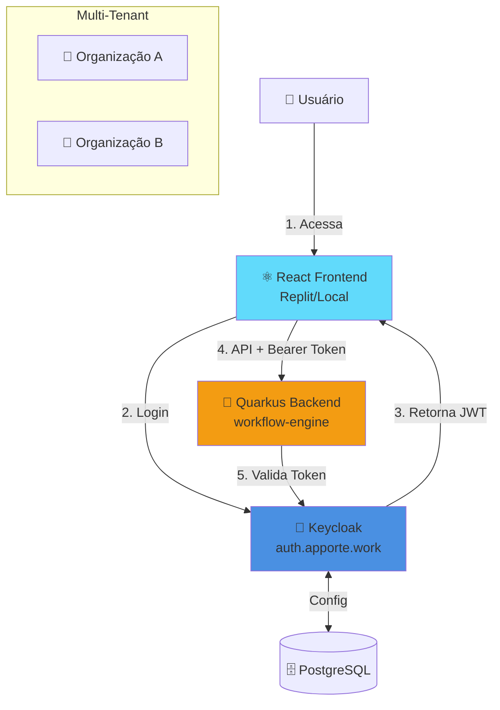

# Keycloak Integration - Apporte 2.0 - Resumo Executivo

## 🎯 Missão Cumprida!

Configuração completa do Keycloak para autenticação e autorização multi-tenant no Apporte 2.0.

---

## 📐 Arquitetura Implementada



### Características Principais

✅ **Multi-tenant**: Cada organização isolada com papéis internos  
✅ **5 Roles**: System Admin, Org Admin, Proponente, Parecerista, Investidor  
✅ **SSO**: Single Sign-On entre todos os serviços  
✅ **JWT**: Tokens com org_id e org_name para isolamento  
✅ **PKCE**: Segurança extra para SPAs  

---

## 📚 Documentação Criada

| Documento | Descrição | Status |
|-----------|-----------|--------|
| **[keycloak-setup-guide.md](keycloak-setup-guide.md)** | Configuração manual passo a passo do Keycloak | ✅ Completo |
| **[keycloak-backend-integration.md](keycloak-backend-integration.md)** | Integração Quarkus + OIDC | ✅ Completo |
| **[keycloak-frontend-react.md](keycloak-frontend-react.md)** | Integração React + keycloak-js | ✅ Completo |
| **[keycloak-testing-guide.md](keycloak-testing-guide.md)** | Testes e troubleshooting | ✅ Completo |

---

## 🚀 Passo a Passo Rápido

### 1️⃣ Configurar Keycloak (30 min)

```bash
# Abrir Admin Console
open https://auth.apporte.work/admin

# Seguir guia passo a passo:
# docs/deployment/keycloak-setup-guide.md
```

**Criar**:
- ✅ Realms (development, production)
- ✅ Roles (system-admin, org-admin, proponente, parecerista, investidor)
- ✅ Groups (organizações)
- ✅ Clients (frontend-dev, workflow-engine-dev)
- ✅ Client Scopes (organization)
- ✅ Usuários de teste

### 2️⃣ Configurar Backend (20 min)

```bash
cd /home/joaopedro/workflow-engine

# 1. Obter client secret do Keycloak
# Admin Console → Clients → workflow-engine-dev → Credentials

# 2. Configurar secret
nano src/main/resources/application-dev-keycloak.properties
# Substituir: quarkus.oidc.credentials.secret=SEU_SECRET_AQUI

# 3. Iniciar backend
./mvnw quarkus:dev -Dquarkus.profile=dev-keycloak

# 4. Testar
export TOKEN=$(curl -s -X POST 'https://auth.apporte.work/realms/development/protocol/openid-connect/token' \
  -d 'client_id=apporte-frontend-dev' \
  -d 'username=proponente@exemplo.com' \
  -d 'password=Proponente@123' \
  -d 'grant_type=password' | jq -r '.access_token')

curl -H "Authorization: Bearer $TOKEN" http://localhost:8081/api/auth/me | jq '.'
```

### 3️⃣ Configurar Frontend (30 min)

```bash
# 1. Instalar dependência
npm install keycloak-js

# 2. Criar arquivos
# Seguir: docs/deployment/keycloak-frontend-react.md
# - src/config/keycloak.ts
# - src/contexts/AuthContext.tsx
# - src/components/ProtectedRoute.tsx
# - src/services/api.ts

# 3. Testar
npm start
```

### 4️⃣ Testar Tudo (15 min)

```bash
# Script automatizado
cd /home/joaopedro/workflow-engine
./scripts/test-keycloak-integration.sh
```

---

## 🔑 Credenciais de Teste (Development)

| Usuário | Senha | Role | Organização |
|---------|-------|------|-------------|
| admin@apporte.dev | Admin@123 | system-admin | - |
| proponente@exemplo.com | Proponente@123 | proponente | org-exemplo |
| parecerista@exemplo.com | Parecerista@123 | parecerista | org-exemplo |
| investidor@exemplo.com | Investidor@123 | investidor | org-exemplo |

---

## 🛠️ Arquivos Criados

### Backend (workflow-engine)

✅ **Dependências** (pom.xml):
- quarkus-oidc
- quarkus-security

✅ **Configuração**:
- `application-dev-keycloak.properties` (development)
- `application-prod-keycloak.properties` (production)

✅ **Classes Java**:
- `KeycloakUserContext.java` - Context com dados do usuário
- `OrganizationFilter.java` - Validação multi-tenant
- `AuthTestController.java` - Endpoints de teste

### Scripts

✅ `test-keycloak-integration.sh` - Testes automatizados

### Documentação

✅ 4 guias completos (ver tabela acima)

---

## 🎓 Como Usar no Código

### Backend (Quarkus)

#### Proteger Endpoint

```java
@GET
@Path("/propostas")
@RolesAllowed({"proponente", "org-admin"})
public Response listarPropostas() {
    // Apenas proponentes e org-admins podem acessar
}
```

#### Acessar Dados do Usuário

```java
@Inject
KeycloakUserContext userContext;

@GET
@Path("/minhas-propostas")
@Authenticated
public Response minhasPropostas() {
    String userId = userContext.getUserId();
    String orgId = userContext.getOrganizationId().orElse(null);
    
    // Buscar propostas do usuário na organização dele
    return Response.ok(propostas).build();
}
```

### Frontend (React)

#### Proteger Rota

```typescript
<Route
  path="/propostas"
  element={
    <ProtectedRoute requiredRoles={['proponente', 'org-admin']}>
      <Propostas />
    </ProtectedRoute>
  }
/>
```

#### Acessar Dados do Usuário

```typescript
const { userInfo, isProponente } = useAuth();

return (
  <div>
    <h1>Olá, {userInfo?.name}!</h1>
    {isProponente() && (
      <button>Criar Nova Proposta</button>
    )}
  </div>
);
```

#### Chamar API com Token

```typescript
import api from './services/api';

// Token é adicionado automaticamente pelo interceptor
const propostas = await api.get('/api/propostas');
```

---

## ✅ Checklist de Implementação

### Keycloak (Manual)
- [ ] Realm development criado
- [ ] Realm production criado
- [ ] Roles criadas (5 roles)
- [ ] Groups/Organizações criadas
- [ ] Client frontend-dev configurado
- [ ] Client workflow-engine-dev configurado
- [ ] Client scope organization criado e associado
- [ ] Usuários de teste criados (4 usuários)

### Backend (Arquivos prontos ✅)
- [x] Dependências adicionadas
- [x] application-dev-keycloak.properties criado
- [x] KeycloakUserContext.java criado
- [x] OrganizationFilter.java criado
- [x] AuthTestController.java criado
- [ ] Client secret configurado (fazer manualmente)
- [ ] Backend iniciado e testado

### Frontend (Implementar)
- [ ] keycloak-js instalado
- [ ] src/config/keycloak.ts criado
- [ ] src/contexts/AuthContext.tsx criado
- [ ] src/components/ProtectedRoute.tsx criado
- [ ] src/services/api.ts criado
- [ ] Login/logout funcionando
- [ ] Chamadas à API com token

### Validação
- [ ] Script de testes executado
- [ ] Login via Keycloak funciona
- [ ] Token contém org_id e org_name
- [ ] Backend valida token corretamente
- [ ] Controle de acesso por role funciona
- [ ] Multi-tenancy validado

---

## 🐛 Troubleshooting Rápido

### Backend retorna 401 mesmo com token válido

```bash
# Verificar client secret
cat src/main/resources/application-dev-keycloak.properties | grep secret

# Verificar se Keycloak está acessível
curl https://auth.apporte.work/realms/development/.well-known/openid-configuration

# Ver logs do backend
tail -f target/quarkus.log | grep -i "oidc\|token"
```

### Token não contém org_id

```bash
# Decodificar token
echo "SEU_TOKEN_AQUI" | cut -d'.' -f2 | base64 -d | jq '.'

# Verificar:
# 1. Client scope 'organization' está associado ao client?
# 2. Usuário tem atributos organization_id e organization_name?
# 3. Mappers estão configurados corretamente?
```

### Frontend não redireciona após login

```bash
# Verificar Valid Redirect URIs no Keycloak
# Admin Console → Clients → apporte-frontend-dev → Valid redirect URIs
# Deve conter: http://localhost:3000/* ou https://seu-projeto.replit.dev/*
```

### CORS errors

```properties
# Adicionar no application-dev-keycloak.properties
quarkus.http.cors.origins=http://localhost:3000,https://seu-projeto.replit.dev
```

---

## 🎯 Próximos Passos

1. **Completar configuração manual do Keycloak** (30 min)
   - Seguir [keycloak-setup-guide.md](keycloak-setup-guide.md)

2. **Configurar e testar backend** (20 min)
   - Adicionar client secret
   - Iniciar com profile dev-keycloak
   - Executar testes

3. **Implementar frontend** (30 min)
   - Instalar keycloak-js
   - Criar componentes de autenticação
   - Testar fluxo de login

4. **Validar integração** (15 min)
   - Executar script de testes
   - Validar end-to-end

5. **Deploy em produção**
   - Configurar realm production
   - Deploy backend no Kubernetes
   - Deploy frontend

---

## 📞 Recursos

- **Keycloak Admin**: https://auth.apporte.work/admin
- **API Backend**: http://localhost:8081 (dev)
- **Documentação**: `/home/joaopedro/iac/docs/deployment/keycloak-*.md`
- **Scripts**: `/home/joaopedro/iac/scripts/test-keycloak-integration.sh`

---

## 🎉 Conclusão

Toda a configuração necessária está pronta! Agora é só:

1. Seguir o guia [keycloak-setup-guide.md](keycloak-setup-guide.md) para configurar o Keycloak manualmente
2. Configurar o client secret no backend
3. Implementar o frontend seguindo [keycloak-frontend-react.md](keycloak-frontend-react.md)
4. Testar tudo com [keycloak-testing-guide.md](keycloak-testing-guide.md)

**Tempo total estimado**: ~1h30min

Boa sorte! 🚀
